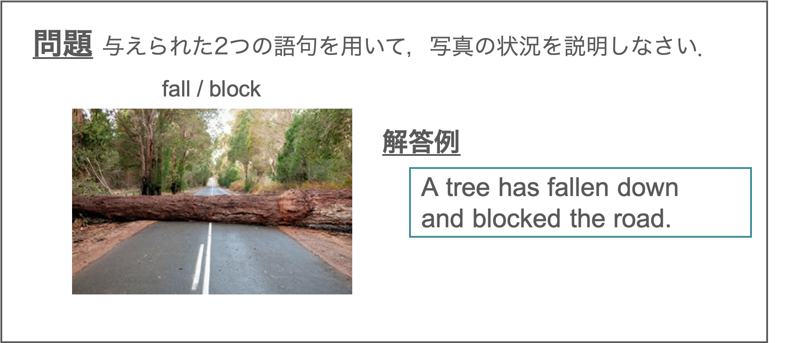
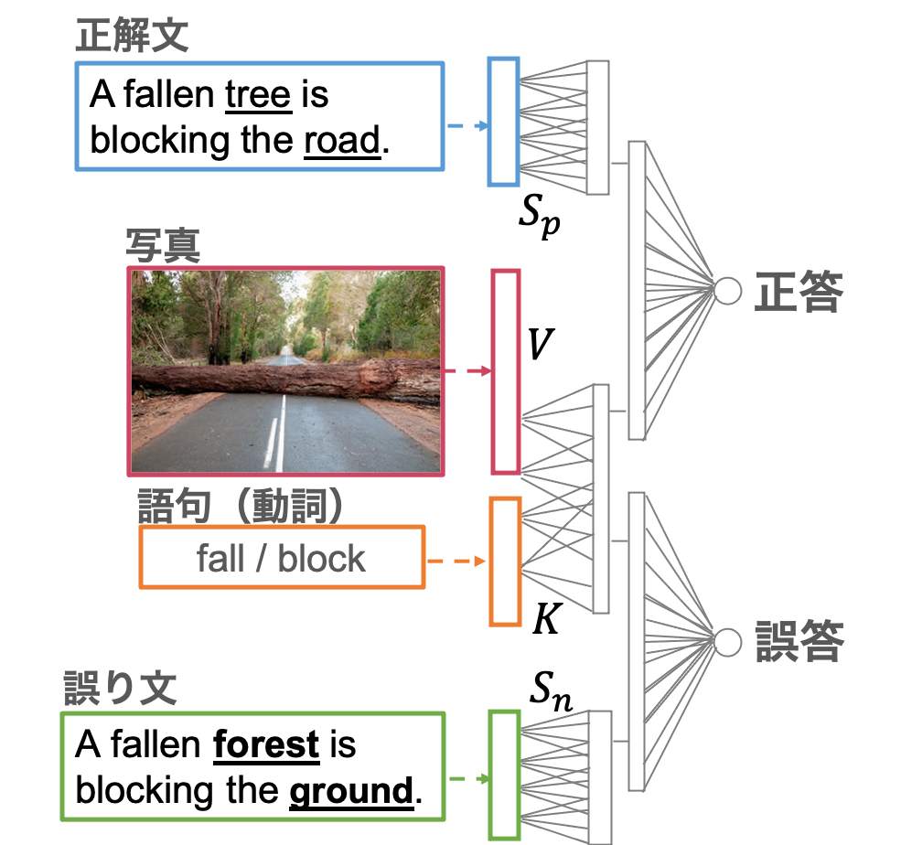

# Auto Grading System
Automatic grading system for language learners.

## About Task 
In this task, test-takers are asked to describe a picture.
- You will write 1 sentence that is based on a picture.
- With each picture, you will be given 2 words or phrases that you must use in your sentence.
- You can change the forms of the words and you can use the words in any order.

The photo-discription problem nurtures language production skills.

## Model
Judge the correctness of the answer based on the semantic features of the picture and answer.

